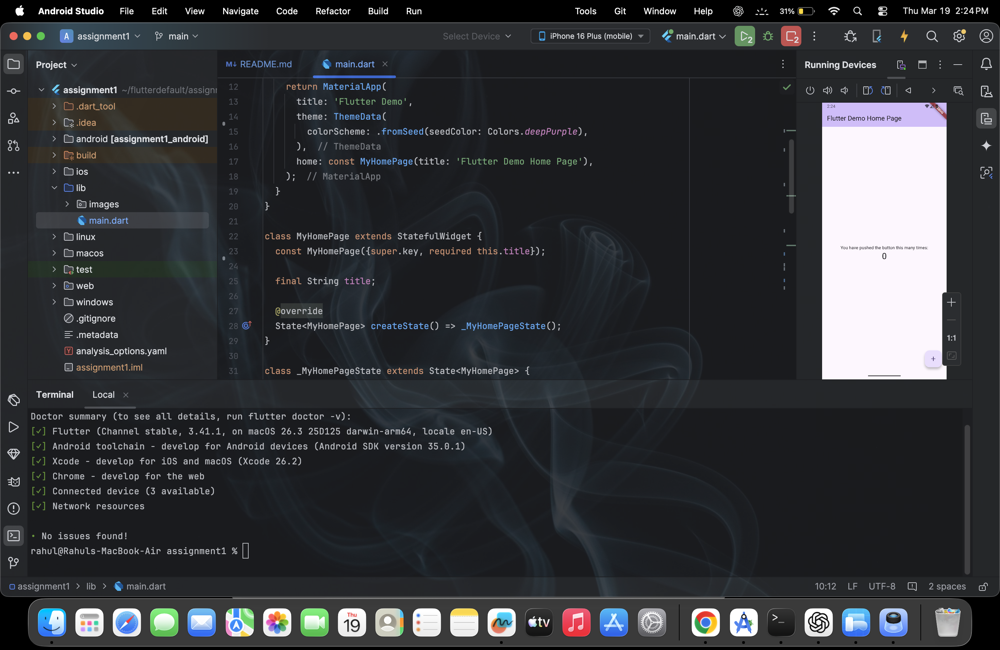

# assignment1

This project demonstrates the successful setup of a Flutter development environment and execution of a sample application.

📌 Objective

The objective of this assignment is to:
•	Set up Flutter development environment
•	Install required tools and plugins
•	Verify setup using Flutter Doctor
•	Run a sample Flutter application

🛠️ Tools & Technologies
•	Flutter SDK
•	Dart
•	Android Studio / VS Code
•	Emulator / Physical Device

⚙️ Setup Verification

The environment was verified using the following command: **flutter doctor**
All required dependencies were successfully installed and configured.

📸 Screenshots

✅ Result
•	Flutter environment successfully configured
•	All dependencies resolved
•	Sample application executed without errors

